<h1>Avax Gods</h1>

A (kinda) realtime Web3 multiplayer card game. [Go to site](https://unscatty.github.io/avax_gods)

<h1>Table of contents</h1>

- [About this project](#about-this-project)
  - [What I learned from making this project](#what-i-learned-from-making-this-project)
  - [TODO](#todo)
- [How to get started](#how-to-get-started)
  - [Install Core Wallet](#install-core-wallet)
  - [Switching to test network and grabbing tokens :ticket:](#switching-to-test-network-and-grabbing-tokens-ticket)
  - [Registration](#registration)
  - [Create a battle :axe:](#create-a-battle-axe)
  - [Join a battle](#join-a-battle)
  - [Battling another player](#battling-another-player)
- [Acknowledgments and tools used](#acknowledgments-and-tools-used)

# About this project

This is my approach to the tutorial video made by JSMastery ["Build and Deploy an Online Multiplayer Web 3 NFT Card Game"](https://www.youtube.com/watch?v=C9ctoK4M9Bk) with a few changes:

- **Vue instead of React** as the UI framework. I used Vue because I'm more experienced with it and the tools and ecosystem around it, also I feel more confident using it as well as more productive, and I like the concepts and the "Vue way" of doing things more than React.
- **Typescript**. I used TS because it lets me add type safety to the code and components without getting in the way. Also getting autocompletion everywhere is pretty nice.
- **Layouts instead of HOCs**. I used layouts to create reusable views instead of using Higher Order Components, because I like this approach better as it seems more elegant and concise, although HOCs are more flexible and customizable. Also, as I used [Vitesse](https://github.com/antfu/vitesse) as starter template, use of layouts is already present, so I didn't have to configure anything.
- **File based routing**. Each `.vue` file inside the `src/pages` folder is taken as a page and generated as a route, so I don't have to do it manually, similar to Next or Nuxt frameworks.
  Again, this functionality is already built into [Vitesse](https://github.com/antfu/vitesse) so I didn't have to take care of it.
- **Pinia stores**. I used stores instead of the context API for React (Vue's equivalent is the Provide/Inject mechanism) because they let me share functionality and data (state) across multiple components, but they also allow me to put each piece of common functionality into a single store, thus making the code more organized and maintainable. Although there is still room for improvement here, it is still better than watching hundreds of `useEffect` all over the place, as in the original source code.
- **UnoCSS instead of Tailwind**. [UnoCSS](https://uno.antfu.me/) is a utility CSS engine used as an alternative to Tailwind or Windi CSS with some advantages such as customization, speed, debug tools and presets. It also lets you use CSS icons using only classes and is easy to install and get started (no need to install PostCSS).

Also I added some more useful features to the site and development process:

- **Smart contract typings**. Thanks to [typechain/ethers](https://www.npmjs.com/package/@typechain/ethers-v5), type information (in the form of classes and interfaces) can be generated directly from the ABI of the contract, so I can interact with the methods exposed by the smart contract with full type safety.
- **Route guards**. To prevent access to protected routes when unauthenticated. So the user has to register in the game before he gets access to it. If he tries to access these routes without being authenticated, navigation is aborted and he is redirected to the registration page.
- **Build and deployment pipeline to GH pages**. When working in the development of the page, the deployment process is an important step to make the changes available to the world outside of localhost.
  To automate this process, I created a workflow using **Github Actions** to build and deploy the project to **Github Pages**. So, when pushing changes to the `main` branch of this repository, a new job is fired and the build and deployment process gets started. Once the job is done, the most recent changes get reflected directly into the website.

The backend part of this project, a HardHat project holding the smart contract and deployment configuration, can be found [here](https://github.com/unscatty/avax_gods_back)

The app's site can be installed as a PWA in a mobile device, using Chrome, instructions can be found [here](https://support.google.com/chrome/answer/9658361?hl=en&co=GENIE.Platform%3DDesktop).
Unfortunately there is still no support (as fas as I know) for Metamask or other wallets for mobile browsers, but you can use the [Metamask Mobile browser](https://metamask.zendesk.com/hc/en-us/articles/6356387482523-How-to-use-the-MetaMask-Mobile-Browser) app when using a mobile device

## What I learned from making this project

By doing this project, I was able to put into practice my knowledge on building frontend applications with Vue. Switching from React, originally used by the author of this project, to Vue helped to greatly understand the structure and logic of the application, so I was able to have a deeper understanding of how all the pieces fit together and the purpose of each one of them. Also, by using a different framework and trying to adapt the original source code, I was forced to think of a different way of doing things instead of just following the tutorial instructions. I was able to introduce some improvements to the code base, as I felt they were a better alternative and fit better with the new framework and toolset.

The addition of Typescript helped avoid some potential sources of errors that can be made when working with pure JavaScript, such as preventing typos and reducing the possibility of implicit type coercion. It also adds strong type safety to the code base, as well as compile-time type information, making the project more easily scalable and maintainable, which can be hard to achieve when using Javascript only.

Vue, being a less popular framework than React, lacks some of the components used in this project, such as the Tilt component or tooltip. This forced me to look for alternative packages that could replace this functionality, discovering more about the Vue ecosystem.

Using Vue DevTools throughout the development of this project was a really satisfying experience, Vue DevTools are nothing but awesome and help to make inspecting and debugging the whole page, as well as individual components and stores easier.

Using Pinia was another big step I took in this project. I have used Pinia before, but at a more basic level. This time I had the opportunity to take a deeper dive into Pinia and more advanced usage, such as using stores outside of Vue components, within router navigation guards, for example, compositing stores using other stores and general usage across many components.

Interaction with the blockchain and the similarities and differences it presents with respect to traditional server/client applications. Using the [ethers](https://ethers.org) library I was able to interact with the smart contract, performing transactions and handling response events, trying to define the flow of incoming data was really challenging as it is a different approach to the request/response cycle. Filtering events, reacting to changes in the wallet state, as well as different user conditions, such as their account balance, were some of the challenges I faced when building this project.

I am very satisfied with the development of this project and the outcome of it, it helped me get a broader approach to blockchain interaction when building DApps, especially events and event filtering, and better understand the potential of distributed applications and their advantages over traditional applications. I also gained more experienced on using Vue for making webapps, namely component re-usability, usage of layouts, folder structuring, reusing some pieces of functionality across multiple components by making composables, sharing state across multiple components using Pinia, among others.
It was overall a really nice educative experience that let me make use of the abilities and tools I have learned about Vue, and also about React, the ecosystem of packages and components surrounding it and the development and build tools, discovering more about these tools and packages and how they interact with each other helps me improve my development skills but it also impresses me and gets me more excited about working with it in upcoming projects.

## TODO

This game is far from being finished, but it works well as a proof of concept and to put into practice the knowledge about frontend development and build tools.

My TODO list for this project is:

- **Overall refactoring of components/stores**. Currently, there are a lot of watchers, either on components or stores, listening to changes on the wallet, smart contract events and DOM updates. This could hurt the performance of the app, especially when multiple events happen and the propagation and flow of data gets slowed down, affecting the UX. Refactoring of variable/function names, structure of the folders and files, avoid unnecessary use of template refs and direct DOM manipulations are some of the actions that can be considered.
- **Refactor wrapper components**. Some components wrap HTML input elements to make easier to build forms, but they are not flexible enough as they don't expose many of the options of this elements
  to be used by the wrapper component, so it is not possible to customize the behavior/appearance of the element via the component options.
- **Cache to local storage**. Some information, like player data (name, address, battle status, ...), account balance or battle info could potentially be stored into the browser's local storage, making the retrieval of this data faster and help improve the site's UX and load times.
- **Improve event handling**. Currently, all the events fired from the smart contract to the site are managed in a single file (a single function actually where many dependencies are injected as parameters), which makes hard to handle events in different situations or edge cases.
- **Improve battle UX**. When in a battle, you have to wait for the transaction to be confirmed after making a move, but also wait for the opponent to make a move. That's why I say this game is _kinda_ realtime, because you need to wait between 15 to indefinite seconds to be able to make another move, which gets frustrating quite easily. While there is not much to do here, as this is the way the blockchain works and also transactions in the Avalanche network get confirmed fairly quickly, there's room for some improvements into the game experience. Limit the amount of time the opponent has to make a move and also adding more notifications about the status of the battle, like when a player makes a move, are some examples of this. But, many of these improvements fall outside the scope of the frontend part of the game, to further improve the overall experience it is necessary to make changes to the backend part of the DApp, the smart contract, which brings me to the next point on this list
- **Refactor the smart contract for the game**. Currently, there are some flaws in the smart contract that somehow limit the user experience, especially the gameplay. Things like only being able to be in one battle at a time, lack of name validation for battles and players, and a really basic gameplay are some examples of the current problems. Other improvements may include, better event handling, being able to join multiple battles at a time, so you don't get locked in into a single one, notifications about the the opponent status (online, offline, idle) and a simple battle chat. All of these improvement would require a fair amount of time and effort to be implemented and tested.

# How to get started

First of all, you will need a Web3 wallet. [Core wallet](https://core.app/) is recommended but you can use any other, such as MetaMask.

## Install Core Wallet

For the purpose of this quickstart guide, Core will be used. You can get the Core extension at their [official page](https://core.app/) or from the [Chrome store](https://chrome.google.com/webstore/detail/core-crypto-nft-wallet-ex/agoakfejjabomempkjlepdflaleeobhb?hl=en-US).

Once installed, this screen will show up:

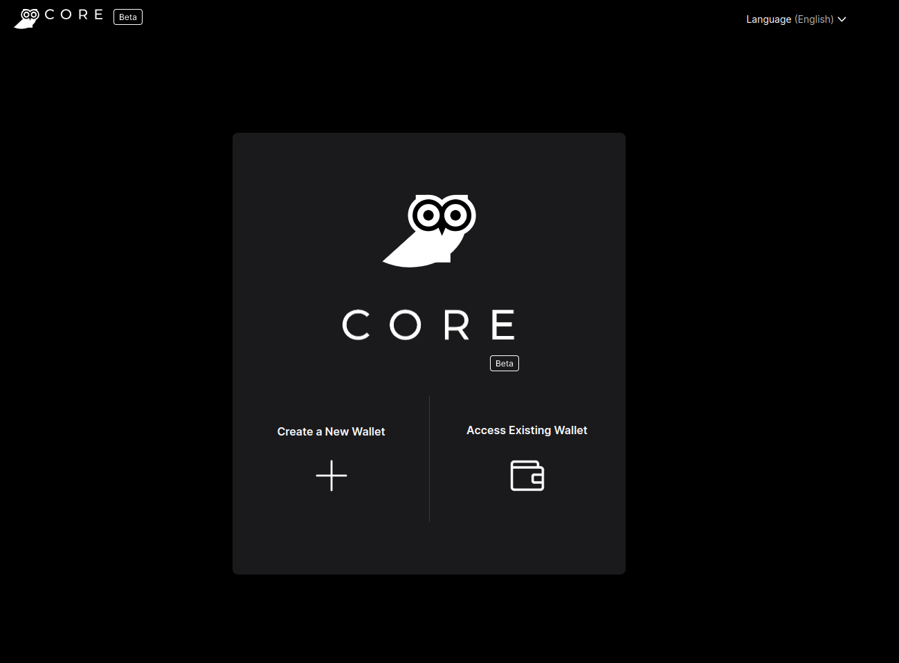

Now, click on **_Create new Wallet_**.

**Read** and accept the ToU and Privacy Policy.

Then, give a name to the wallet and create a password. Don't forget to check the ToU and Privacy Policy, and click **_Save_**

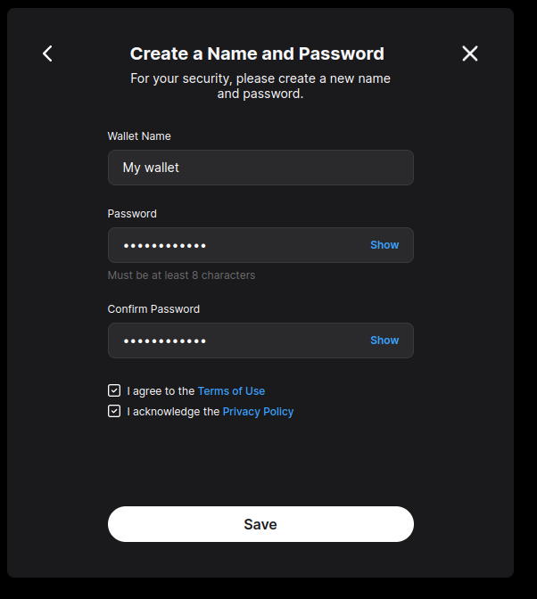

Next, your recovery phrase. Copy it and store it in a safe place, as advised. You will need it for the next step. Why do you need a recovery phrase? You can read about [here](https://www.skiff.com/blog/wallet-recovery-phrase)

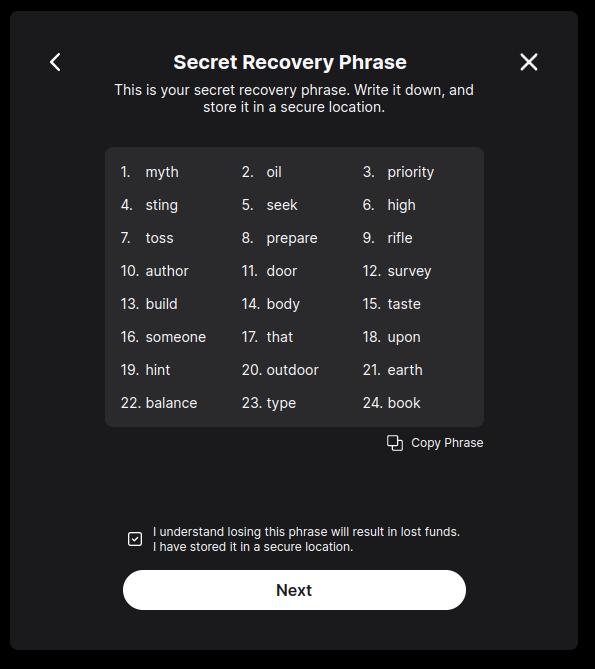

After that, to make sure you have access to your recovery phrase, you will be asked for words that are present in it. Follow the hints and click **_Next_**

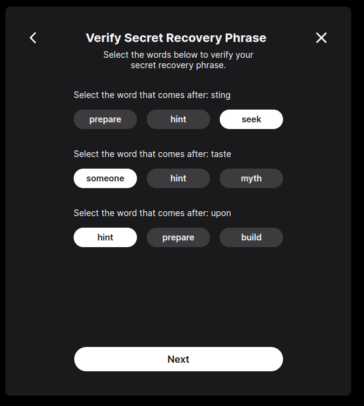

If everything is OK, you will get a message that wallet has been created.

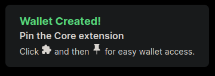

You can pin the extension for easy access to it.

If you click on the Core icon (that little owl) you should get something like this

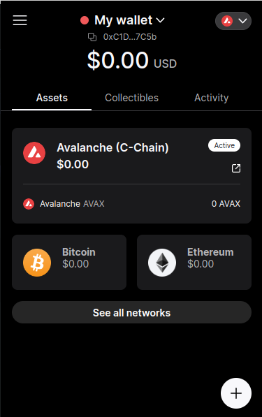

Nice! You have created a new wallet and a new account address has been added to it.

That was tough, now you can continue with the next steps.

## Switching to test network and grabbing tokens :ticket:

Now that you have a wallet and an account, go to the [main page of the DApp](https://unscatty.github.io/avax_gods/)

You will be prompted to connect your wallet to this site. Click **_Approve_**

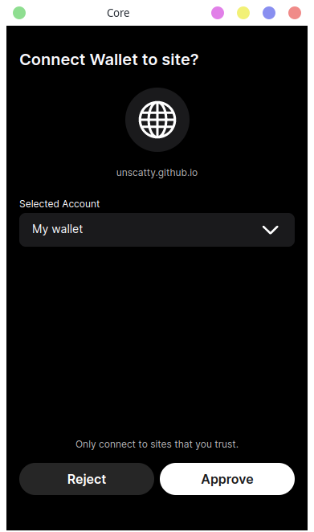

Once you have connected your wallet, you are prompted with this screen

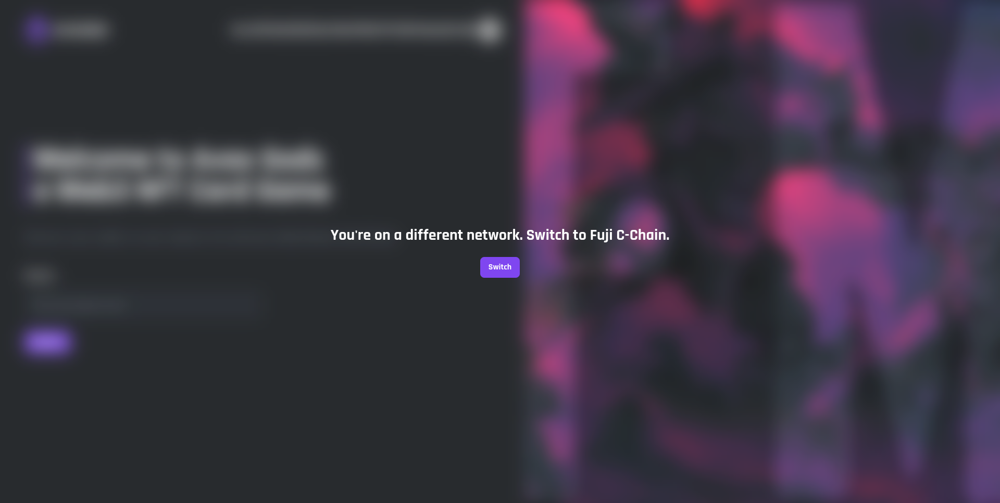

Don't panic. The contract for this DApp is deployed over the Avalanche Test network (C-chain). For you to be able to interact with it, you must be on the same network.
But hey, don't worry, just click on **_Switch_** and the network will be added to Core for you.

When you click on **_Switch_** you will be asked for permissions to switch to the _Fuji C-Chain_ network. Click on **_Approve_**

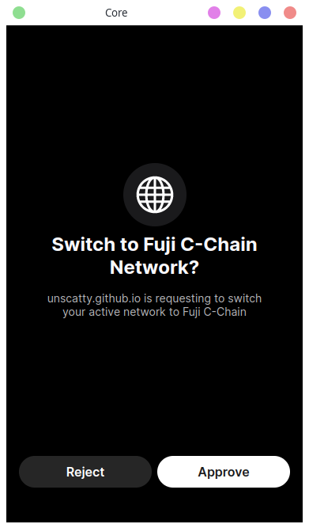

Now you're prompted with this screen

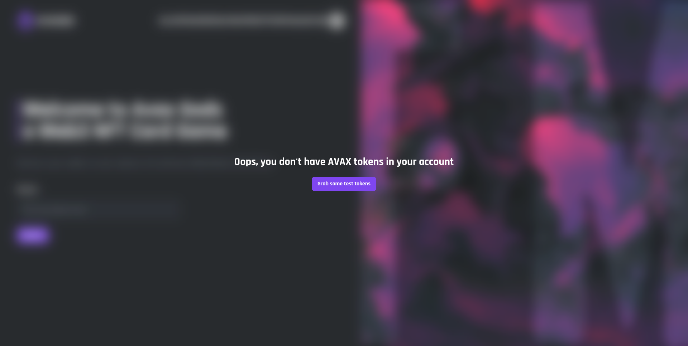

What is going on? Well, to be able to interact with the network (any blockchain network), you need tokens, which are used as currency. Each network has its own currency, in the case of Avalanche they're called AVAX Tokens.

You can get **test** tokens for your account from the Avalanche Faucet, so go grab some.

Click on the button, and a new tab opens. There you need to type your account address, or you can connect to it using the **_Connect_** button. Also make sure the network is set to _Fuji C-Chain_ and token is set to AVAX

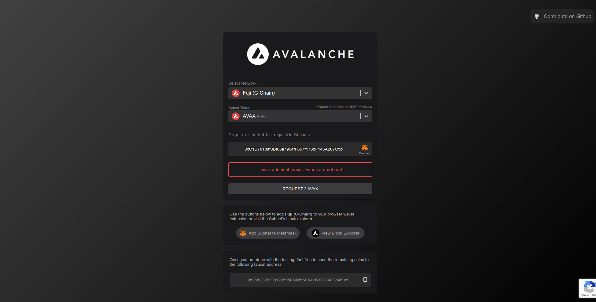

Click on **_Request 2 AVAX_**. You should see, after a few seconds, a message that transaction was successful.

Now you should see those tokens in your account balance now.

**Remember these tokens are not real. They're only usable in the Avalanche Test network and nowhere else. They're not real money**

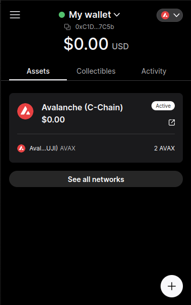

Go back to the page, the _"not enough tokens"_ message should be gone, try reloading the page if not.

Your screen should now look like this.

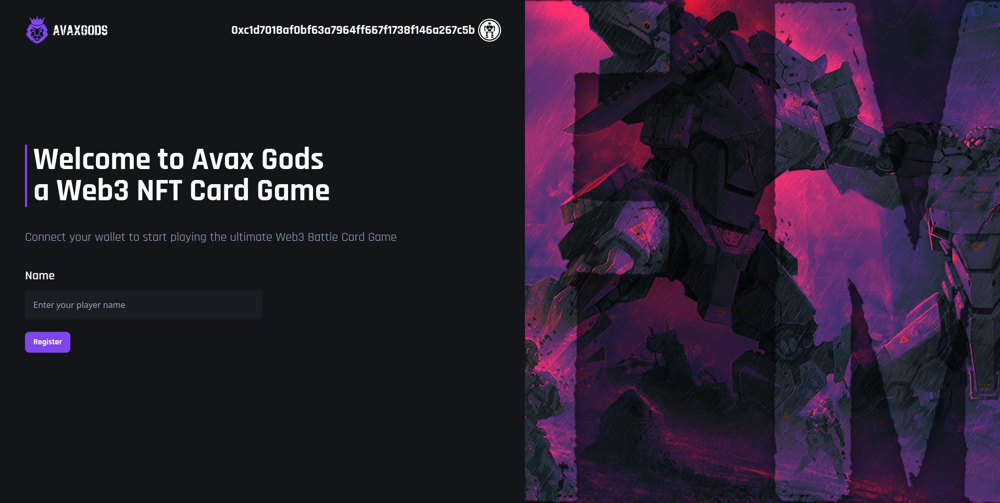

## Registration

To be able to create and join battles, you need to register first. In the main page, enter a name in the text field, the click on **_Register_**. You should be prompted with a request to execute a transaction. Click on **_Approve_**

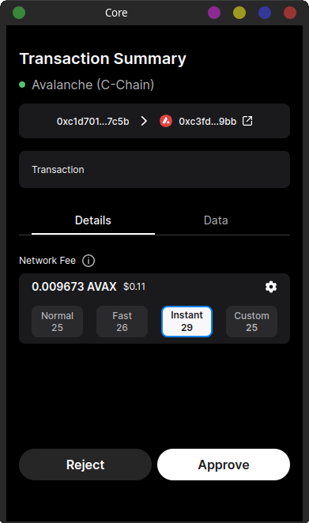

After the transaction get confirmed, you are taken to the **Create Battle page**. Your player name should be displayed instead of your account address.

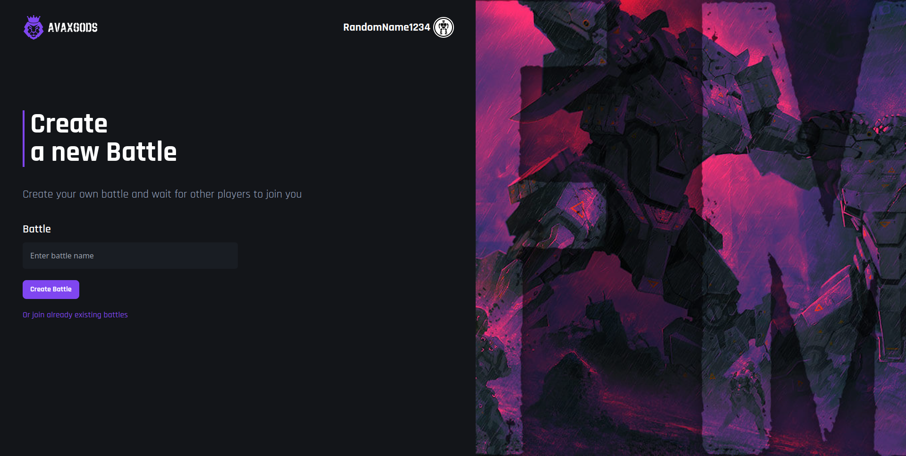

## Create a battle :axe:

On the **Create Battle page** you can create new battles (dah) to battle other players.

To create a battle, give it a name and then click on **_Create battle_** and approve the transaction. You get this screen.

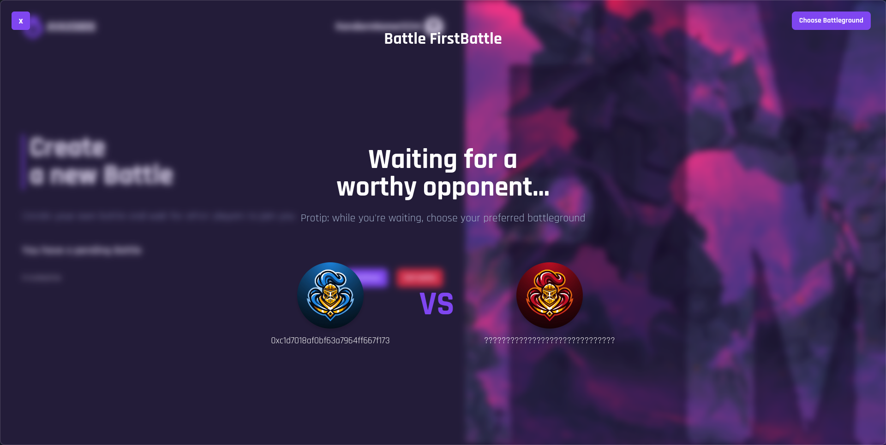

While you wait for other player to join the battle, you can choose between 4 different battlegrounds by clicking the **_Choose Battleground_** button.

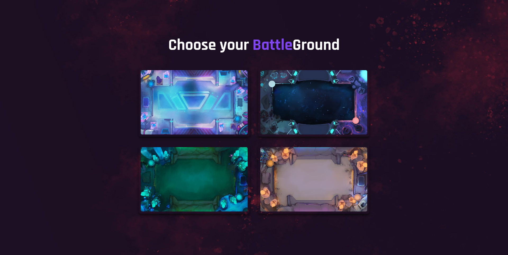

## Join a battle

To join a battle you can go to the [**Join Battle page**](https://unscatty.github.io/avax_gods/join-battle), where you should see the battle we created in [Create a battle](#create-a-battle-axe).
Click on **_Join_** and approve the transaction. Here I'm using a different account to simulate a second player joining a battle.

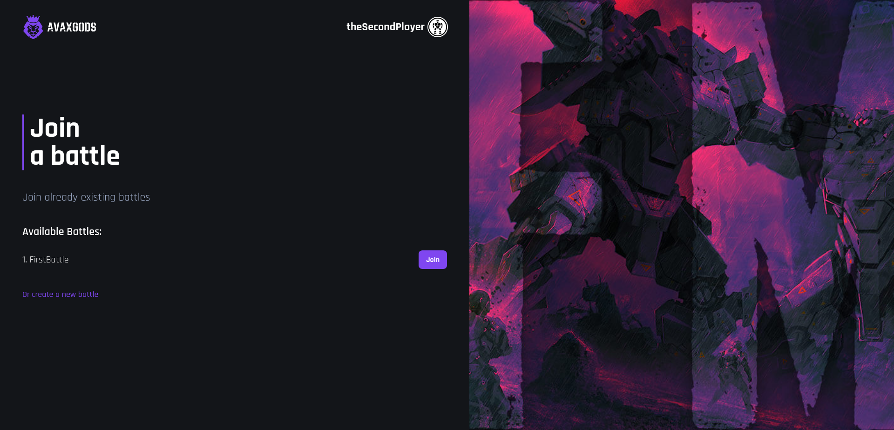

Once the transaction is confirmed, both players will be redirected to the battle stage, here's where the action happens.

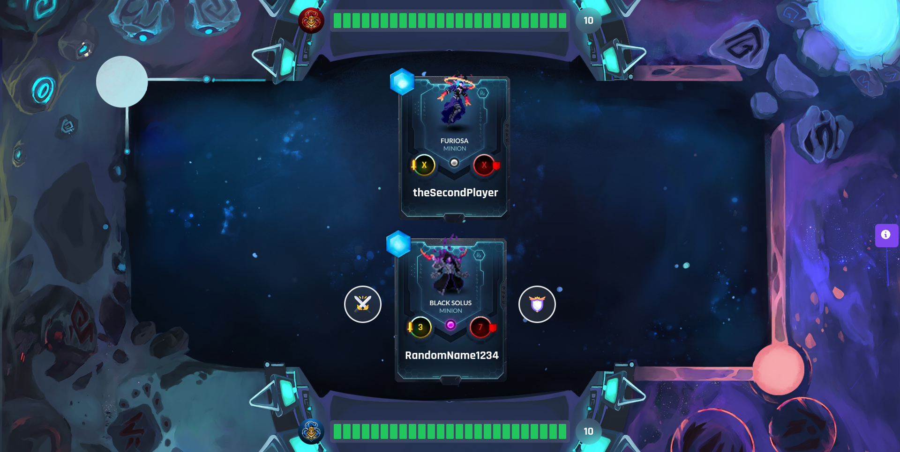

## Battling another player

Now it is time for the real action.

To fight another player, you can perform two actions. **Attack** (the crossed swords button) or **Defend** (the shield button). Both players start with 25 health points.
The game is played by rounds. One round ends once every player has made a move. When a round is over, the status of the battle (players HP, mana, etc) gets updated.

You can always read the game rules by clicking in the info button (the "i" on the right) during a battle.

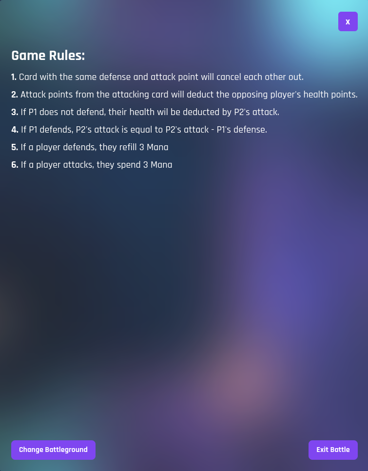

To perform an attack move, click on the attack button, when a confirmation prompt is shown, approve the transaction. Defense move is pretty much the same.

You have to wait for your opponent to make their move before you can make another move.

To exit a battle, click on the info button, then click on **_Exit Battle_** and approve the transaction. You will need to confirm the action. Be aware that you will automatically lose the battle if you exit.

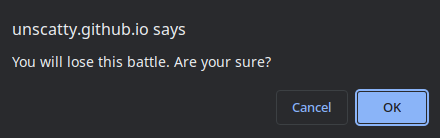

The battle ends when one of the players loses all of his HP.

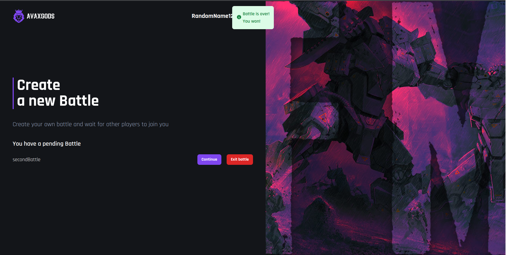

Well, that's pretty much it. Have fun.

# Acknowledgments and tools used

- [JSMastery](https://www.youtube.com/@javascriptmastery), for their outstanding [tutorial on this game](https://www.youtube.com/watch?v=C9ctoK4M9Bk) and the awesome content they make
- [Vitesse](https://github.com/antfu/vitesse), the starter template I used to scaffold this project
- [Pinia](https://pinia.vuejs.org), awesome state management library for Vue
- [Vite](https://vitejs.dev), awesome build tool that makes frontend development a breeze

among many others, full package list can be found in [package.json](package.json)
